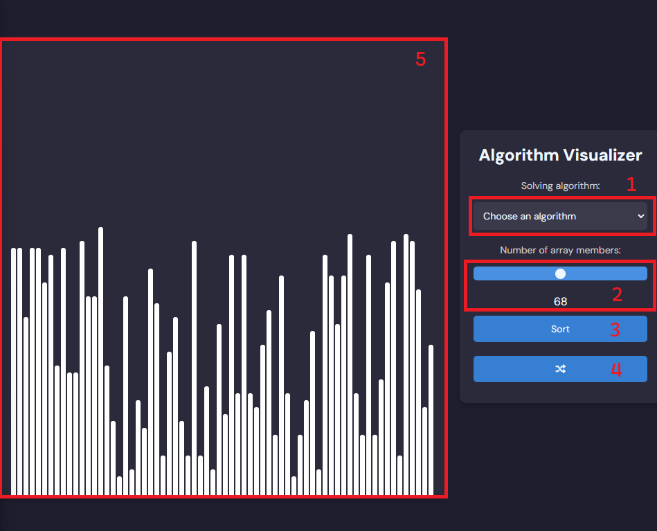
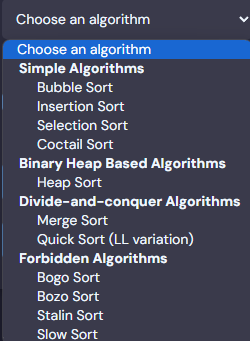

# Sorting Algorithm Visualizer
 Visualizes sorting algorithms. Whole project will be a webstie made in Html, CSS and JS. Main idea for the project came as i was bored, wanted to teach myself JS and wanted to check if i remember some sorting algorithms.
 
# How to use

1. Choose an algorithm menu. Choose a solving algorithm

2. Slider to choose number of array members to sort

3. Sort button. Starts sorting process. The process cannot be stopped in any way, if the wrong data is put in the site has to be reloaded.

4. Randomize button. Randomizes an array.

5. Box to visualize array members as bars.

# Future improvement
It is a simpe application. The more advanced version could implement more algorithms, maybe implement sound, change the delay depending on an algorithm and show it on a screen, would count and display array accesses, swap operations, would have a strict color code depending on an operation on an array member, would have a way to stop during operation and would warn before using forbidden algorithms (they are forbidden for a reason).